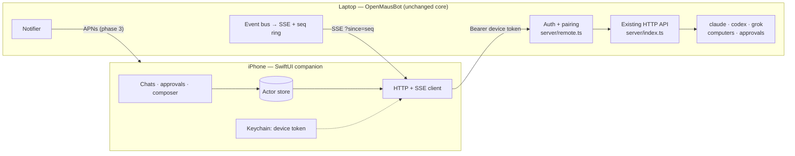

# iOS companion — architecture and plan

**Status:** built and working on an iPhone — pairing, roster, sending, approvals,
and reach from any network over Tailscale. Push (APNs) is still design.

**The shape changed late, and the rest of this document predates it.** The
companion no longer lives inside the harness. It is a separate process,
`companion/`, that a paired phone reaches and that speaks to the harness over
loopback as an ordinary client. Read [The sidecar](#the-sidecar-and-why) before
taking any of the Layer 1 design below as current — the *decisions* there still
hold, but they are implemented one process to the left of where they are
described.

The goal: your bots keep running on the laptop, and the phone becomes the place you
watch them, answer their approvals, and send them the next thing. The laptop stays
the only machine that owns agent processes, credentials, transcripts and computers.
The phone owns nothing — it is a second client on the same harness the desktop app
already talks to.

## What the repo gives us for free

The harness was already built for exactly this shape. From the README's own rule —
*"clients hold no transports"* — the desktop app is already a thin client:

| Piece | Where | Why it matters for iOS |
|---|---|---|
| Whole API is HTTP + JSON | `server/index.ts` | No Electron/IPC coupling. A native client is a first-class peer, not a hack. |
| One SSE stream for all state | `GET /api/events`, `server/index.ts:1075` | The phone folds the same frames the React store folds (`src/state/store.tsx:1058`). |
| Server-side event folding | `bus.subscribe(...)`, `server/index.ts:174` | The server already turns provider events into settled `Message` records. The phone can render `message` / `message.patch` frames and skip most protocol work. |
| Full hydration in one call | `GET /api/bots` | Cold start / reconnect is a single request. |
| Approvals are thread-addressed | `POST /api/threads/:threadId/respond`, `server/index.ts:1358` | Answering an approval from the phone needs **zero** new server concepts. |
| Voice already server-side | `POST /api/tts/speak` | The phone can play a reply aloud without an ElevenLabs key on-device. |
| Canonical per-thread log | `~/.openmausbot/events/<threadId>.ndjson`, `server/harness/bus.ts:34` | A durable backing store for catch-up replay after the phone was asleep. |

So the companion is **not** a rewrite. It is: make the harness reachable and
authenticated, make its stream resumable and cheap, and write a native client.

## What blocked it

The gaps this plan set out to close, in the order they bite. Layers 1 and 2 have since
closed 1–6; the line references below point at the code as it stood before that.

1. **The server is loopback-only.** `server.listen(PORT, "127.0.0.1")` (`server/index.ts:1638`).
   A phone cannot reach it at all.
2. **There is no authentication on `/api/*`.** Only `/api/internal/*` is guarded by a
   boot-generated bearer token (`server/index.ts:945`). That is a correct and
   deliberate design *for a loopback socket*. The moment the socket leaves loopback,
   anything on the network can start turns, approve shell commands, read every
   transcript, and PUT new API keys via `/api/config`. **Auth is a hard prerequisite
   for binding anywhere else — not a follow-up.**
3. **The SSE stream is not resumable.** Broadcast frames carry no sequence number and
   the endpoint honours no `Last-Event-ID` (`server/index.ts:1075`). A desktop client
   papers over this by re-fetching everything on reconnect. A phone reconnects
   constantly (backgrounding, cell↔wifi, tunnels), so "refetch the world" is the wrong
   default.
4. **Hydration is heavy.** `GET /api/bots` returns *every* bot with its *entire*
   transcript, plus every group with its entire transcript (`server/index.ts:1096`).
   Fine over loopback; not fine on cellular.
5. **Screen frames are fat and unconditional.** The box preview broadcasts a base64
   frame every ~6s to *all* SSE clients while a bot works (`server/index.ts:389`), and
   the turn-end frame is persisted inline in the transcript as `message.png`
   (`server/index.ts:341`). A phone that never opened the computer panel still pays for
   it, twice.
6. **There are no notifications of any kind.** `BotRecord.notifications` exists
   (`server/store.ts:137`) and the settings toggle writes it
   (`src/components/SettingsPanel.tsx:359`) but **nothing reads it.** It is a dead
   switch. For a companion, "your bot is waiting on you" is the entire product.
7. **No pairing/device concept.** No device list, no revoke, no "this phone is
   connected" surface in the desktop UI.

## Architecture



Four layers, each shippable on its own.

### Layer 1 — reachability and identity (server, this repo)

New file `server/remote.ts`, plus a small amount of wiring in `server/index.ts`.

- **Opt-in second listener.** Keep `127.0.0.1:8799` exactly as it is — the desktop app,
  the agents-proxy, and every test keep working untouched. When the user turns
  *Settings → Companion* on, bind a **second** listener on `0.0.0.0` (same request
  handler). Off by default. Persisted in `~/.openmausbot/config.json`.
- **Auth by socket, not by route.** One check at the top of the handler:
  a request arriving on the loopback listener is trusted (today's behaviour, unchanged);
  a request on the remote listener must present `Authorization: Bearer <device-token>`.
  This is the smallest change that cannot regress the desktop.
- **Pairing.** Desktop shows a QR containing `{host, port, code}` where `code` is a
  short-lived (2 min) one-time code. Phone scans it, `POST /api/pair {code, deviceName}`
  → a long-lived per-device token. Tokens live in `~/.openmausbot/devices.json` with
  name / created / last-seen, and the Companion settings panel lists and revokes them.
- **Discovery.** Advertise `_openmausbot._tcp` over Bonjour so the phone finds the
  laptop on the same Wi-Fi with no typing — written out rather than taken as a
  dependency (see below).
- **Scope the token.** A paired phone should not be able to rewrite the user's API keys.
  Simplest useful split: device tokens are denied `PUT/PATCH /api/config` and the
  `/api/local-computer/*` lifecycle routes. Everything else (chat, approvals, tasks,
  routines, computer view) is allowed.

#### What shipped

Built as described above, in `server/devices.ts`, `server/remote.ts`, and the auth gate
in `server/index.ts`:

- **Two listeners, not one bind.** `127.0.0.1:8799` is byte-for-byte the socket it always
  was — the desktop window, the agents-proxy and the tests are unaffected. The companion
  is a *second* `http.Server` running the same handler with `remote: true`, on
  `0.0.0.0:8800` (`OMB_REMOTE_PORT`). This is what makes "did this come from this
  machine?" a structural fact rather than an address guess: a single `0.0.0.0` bind
  reports `localAddress` `127.0.0.1` for loopback traffic, so one socket could not tell
  the desktop app from the coffee-shop wifi.
- **Default deny on the companion socket.** `remoteDenial()` allows a route family
  explicitly, so anything added later is closed to phones until someone opens it. A
  paired phone may chat, answer approvals, manage tasks and rooms — and may **not**
  write API keys (`PUT /api/config`), manage the companion (`/api/remote/*`,
  `/api/devices/*` — losing the phone must not mean losing the ability to lock it out),
  drive Local VM lifecycle, reach `/api/internal/*`, or load the packaged UI.
- **Tokens are write-only, like the API keys.** Pairing mints `omb_<32 random bytes>`,
  returns it once, and stores only its SHA-256 in `~/.openmausbot/devices.json`. Nothing
  can read it back; a phone that loses it pairs again. Comparisons are constant-time.
- **The six-digit code is never the whole defence.** It lives two minutes, dies after
  five wrong guesses, and only exists while the user is on the pairing screen.
- **Off by default**, remembered across restarts only if it actually bound — a failed
  bind (port in use) reports rather than persisting a broken "enabled".

**Discovery is Bonjour, with no dependency.** `server/mdns.ts` is a responder for the
half of RFC 6762/6763 we actually need: answer questions about our own service, announce
on arrival, and send a zero-TTL goodbye on the way out. It is ~380 lines of DNS message
encoding and a multicast socket, against a dependency tree running inside the process
that holds the user's API keys — the house rule about not taking a dependency where code
will do points the same way. Details worth knowing:

- **A PTR answer carries SRV, TXT and A as additionals** (RFC 6763 §12), so browsing
  resolves in one round trip rather than three. That is the difference between a picker
  that fills in instantly and one that looks broken for a second.
- **The host record is `openmausbot-<hash of hostname>.local`, not `<hostname>.local`.**
  On macOS the system responder owns the latter and defends it; picking a fight with
  mDNSResponder over the user's own machine name is a bad trade for a companion feature.
- **We do not probe for name conflicts** (§8.1). The claimed host name is derived from
  the machine's hostname, so a collision takes two machines with the same hostname on one
  network, and costs a duplicate row in a picker rather than anything broken.
- **Discovery failing is not an error.** Port 5353 taken, no multicast on this network —
  the panel falls back to showing the address to type. The listener never depends on it.
- The advertised name follows the profile name, and re-announces when it changes rather
  than leaving a stale name on the network.

`server/devices.test.ts` covers the registry contract, `server/mdns.test.ts` the wire
format byte by byte (against packets built by hand, not by the encoder under test) plus
the socket loop over an ephemeral unicast port; `server/index.test.ts` boots the real
server and exercises the handshake over the network socket, including every refusal
above.

**Out of the house:** deliberately *not* solving NAT traversal in v1. Same-Wi-Fi is the
honest first release. For remote access, document Tailscale — the laptop and phone both
run it, the phone hits the tailnet IP, and the auth layer above is what makes that safe.
A project-run relay (laptop dials out, phone connects, both meet at a WebSocket broker)
is a phase-4 decision with real hosting, cost and privacy consequences; it should not
gate v1.

### Layer 2 — a stream a phone can actually hold (server)

- **Sequence the broadcast.** Give every frame emitted by `broadcast()` a monotonic
  `seq`. Keep the last ~500 frames in a ring buffer. `GET /api/events?since=<seq>`
  replays what the client missed and then goes live; if `since` is older than the ring,
  answer `{kind:"resync"}` and let the client do a full hydrate. This is ~30 lines and
  it fixes reconnect for the desktop too.
- **Paginate hydration.** `GET /api/bots?messages=<n>` (default full, so nothing
  breaks) and `GET /api/threads/:threadId/messages?before=<messageId>&limit=50` for
  scrollback.
- **Get images out of the transcript body.** Serve `screen` messages' pixels from
  `GET /api/threads/:threadId/messages/:id/image` and omit `png` from list payloads
  when the client asks for the slim shape. Same for live frames: only push `screen`
  SSE frames to a client that has said it is watching (`POST /api/devices/:id/watch`
  or a query param on `/api/events`).
- **Wake the dead notifications flag.** A `Notifier` subscribed to the bus that fires on
  the three things worth a buzz: `request.opened` (approval or question — the important
  one), `turn.completed` for a bot with `notifications: true`, and routine-run failures
  (`server/routines.ts`). Deliver over SSE as a `{kind:"notify"}` frame first — that
  alone gives correct behaviour while the app is open — with APNs behind the same
  interface later.

#### What shipped

- **The stream is resumable.** Every broadcast frame is numbered and the last 500 are
  kept. A client reconnects with its cursor and gets exactly what it missed, or an
  explicit `resumed: false` telling it to hydrate — never a partial replay, which would
  leave a permanent hole in its state. The cursor is `<streamId>:<seq>` and rides in the
  SSE `id:` field, so a **browser EventSource resumes through its own `Last-Event-ID`
  with no client code at all**; the stream id is what keeps a cursor from a previous
  boot (where the sequence restarted at 1) from replaying the wrong run's frames.
  The desktop app now hydrates only when the server says it must — previously it
  re-downloaded every transcript on every reconnect.
- **Hydration can be paged.** `GET /api/bots?messages=n` returns the newest n per thread
  with `hasMore`; `GET /api/threads/:threadId/messages?before=&limit=` walks backwards
  for scrollback. Omitting `?messages` returns exactly the shape it always did, so the
  desktop is untouched. An unknown `before` cursor is a 404 rather than a silent newest
  page — otherwise a client paginates in a circle and never reaches the top.
- **Images are fetched, not pushed.** In the paged shape a `screen` message carries
  `hasImage: true` instead of a base64 PNG; the pixels come from
  `GET /api/threads/:threadId/messages/:id/image`, cached immutably.
- **Live screen frames are opt-out.** `GET /api/events?screens=off` drops the ~6-second
  desktop captures for clients that aren't showing the computer panel. The filter
  applies to replay too, so an opted-out client's cursor stays meaningful.
- **`BotRecord.notifications` finally does something.** `server/notify.ts` holds the
  policy — a bot *blocked on you* is worth an interruption, a bot that *finished* is
  worth one if you asked, and nothing else is — and the harness emits
  `{kind:"notify", notification}`. The hook sits at the point in the event fold where a
  card actually reaches a human, so anything auto mode answered by itself never buzzes.
  The desktop consumes it as a native notification when the window isn't focused, which
  makes the existing settings toggle real on desktop as well as on the phone.

### Layer 3 — the iOS app

Native **SwiftUI, iOS 17+, zero third-party dependencies.** Reasons: SSE over
`URLSession.bytes` is ~60 lines; the data model is small and already JSON; Keychain,
Bonjour (`NWBrowser`), QR (`VisionKit`/`AVFoundation`), and notifications are all
first-party; and a React Native shell would drag in a build system this repo doesn't have.

```
ios/OpenMausCompanion/
  Networking/   Endpoint.swift  SSEClient.swift  Pairing.swift  Discovery.swift
  Model/        Bot.swift  Group.swift  Message.swift  RuntimeEvent.swift   ← mirrors server/store.ts + server/contracts.ts
  State/        Store.swift (actor)  Reducer.swift                          ← mirrors src/state/store.tsx
  Features/     ChatList/  Chat/  ApprovalCard/  ComputerPanel/  Settings/
  App/          CompanionApp.swift  Keychain.swift  Notifications.swift
```

Design notes that matter:

- **Thin client, on purpose.** The server already folds runtime events into `Message`
  records, so v1 can subscribe to `message`, `message.patch`, `bot`, `group`, `thread`,
  `notify` and *ignore* `runtime` entirely — using `bot.busy` for the typing indicator.
  Token-by-token streaming (`content.delta`) is a nice-to-have layered on after, not a
  prerequisite. This is the single biggest scope saving available.
- **Lifecycle is the hard part, not the UI.** On foreground: `GET /api/bots?messages=50`,
  then open SSE with `?since=`. On background: tear the stream down immediately (iOS will
  kill it anyway) and record the last `seq`.
- **Approval cards are the headline screen.** An `options` message with
  `card.requestId` renders Allow / Deny / Always-allow and posts to
  `/api/threads/:threadId/respond` — plus "always allow" patching `alwaysAllow` on the
  bot, exactly as `src/state/store.tsx:859` does today.
- **Voice is genuinely better on iOS than on desktop.** `/api/tts/speak` returns audio
  the phone can play directly, and call mode's blocker on desktop is that dictation is
  macOS-only (`docs/voice-mode.md`) — `SFSpeechRecognizer` is on every iPhone. Call
  mode is a strong phase-4 feature, not a port of a limitation.

#### What shipped

`ios/` holds a SwiftUI app in two halves. `CompanionCore` is a SwiftPM library
with no UI and nothing beyond Foundation — wire types, the SSE line parser, the
API client, and the fold from frames to state — so it builds and tests with
`swift test` alone. `App/` is the SwiftUI layer plus everything that needs a
device: `NWBrowser` discovery, the keychain, and the lifecycle that decides when
the stream lives.

The thing worth copying from this layer is how the contract is pinned.
`scripts/capture-companion-fixtures.mjs` boots a real harness, drives the real
pairing handshake over the real network socket, and writes the responses to
`ios/Tests/CompanionCoreTests/Fixtures/`. The Swift models were written against
those bytes, and the decoding tests read them — so the app is checked against
what the server *sends*, not against anyone's memory of what it sends. That
caught a live defect on the first run: the `bot` frame was shipping
`resumeCursors`, the harness's own provider session ids, to every client.

Re-run the capture whenever the companion API changes and commit the diff; a
change there is a change to the contract, and reviewing it is the point.

**What the first real run found.** The Swift was written with no toolchain
available, so its first compile was on a Mac. The fixtures did their job — the
core compiled and all 33 tests passed on the first attempt, with no decoding
errors at all. But three bugs still surfaced, every one of them in the few lines
between "URLSession has bytes" and "the app has frames", and every one invisible
to the parser tests because the parser was never wrong: a `timeoutInterval` of
`.greatestFiniteMagnitude` (which URLSession adds to the current time to get a
deadline), letting `URLSession.AsyncBytes` go out of scope (it cancels its task
when released), and reading with `bytes.lines` (which folds consecutive newlines
together and so never reports the blank line that ends an SSE event).

The lesson worth carrying into Layer 4: fixtures pin the *contract* very well
and say nothing about the *plumbing*. `ios/Tests/CompanionCoreTests/EventStreamTests.swift`
is the answer to that — the one test that drives a real `URLSession`.

Two smaller fixes came out of the same session: the `bot` SSE frame was shipping
`resumeCursors` to every client, and `claudeSignedIn` only looked for the
Linux/WSL credentials file, so every signed-in Mac reported as signed out.

### Layer 4 — push, and being away from home

- **APNs** needs something the project does not have: a signing key and a process that
  can reach Apple. The privacy-preserving shape is a stateless relay that receives
  `{deviceToken, kind, botName}` — never message content — and forwards it; the phone
  fetches details itself once opened. Until that exists, notifications while the app is
  backgrounded simply do not arrive, and the app is honest about it.
- **Remote access** is Tailscale-documented first; a relay only if people actually ask.

#### What shipped: remote access

Tailscale needs no protocol work at all — the listener already binds `0.0.0.0`, so a
tailnet address was being served from the day Layer 1 landed. What was missing was
that nobody could *see* it: the panel printed `addresses[0]`, and the tailnet address
is usually not first.

So the work is telling the two addresses apart and saying which is which.
`tailscaleAddress()` in `server/remote.ts` recognises the CGNAT range RFC 6598 set
aside — `100.64.0.0/10`, which is exactly why it never collides with a home network —
and `refreshTailnetName()` shells out to the Tailscale CLI once at startup for
`Self.DNSName`, the MagicDNS name. Both land in `RemoteState`, and the panel prefers
the tailnet, listing the LAN address separately as the secondary thing it now is.

The name matters more than it looks. A phone reaching a tailnet over plain HTTP is on
the wrong side of App Transport Security: `NSAllowsLocalNetworking` exempts the
private ranges, and `100.64/10` is shared CGNAT space rather than one of them, so iOS
refuses the request before it reaches the network. ATS exceptions are by *name*, not
by subnet — so an address cannot be exempted and a hostname can. Every tailnet name
ends in `ts.net`, which makes one `NSExceptionDomains` entry in `ios/project.yml` cover
every machine anyone will ever own. Pair by name, not by number.

This turned out to matter far more than "nice for travelling". The LAN path failed
repeatedly during Layer 3 testing on a network where both devices were demonstrably on
the same SSID: a guest network that isolates its clients drops Bonjour multicast *and*
direct connections, so discovery finds nothing, the typed address times out, and both
ends look healthy. There is nothing to fix on either machine. Tailscale routes around
the whole category rather than diagnosing it, which is why the runbook now sends
people there as soon as a typed address fails (`ios/TESTING.md`, stage 5).

## Plan

| Phase | Deliverable | Where |
|---|---|---|
| **0** | ✅ This document, agreed | `docs/` |
| **1** | ✅ Auth + pairing + opt-in remote bind + Bonjour discovery + Settings → Companion (toggle, code, device list, revoke) — **since moved into `companion/`** | `companion/`, `electron/companion.mjs`, `src/components/CompanionSection.tsx` |
| **2** | ✅ `seq` + cursor replay, paged hydration, image endpoint, opt-out screen frames, `notify` frames | `server/index.ts`, `server/notify.ts`, `src/lib/notify.ts` |
| **3** | ✅ iOS app: pair → chat list → chat → **approvals** → send. Foreground-only. | `ios/` |
| **4** | ✅ Remote access over Tailscale — tailnet address and MagicDNS name surfaced, ATS exempted, runbook. Still open: computer panel, streaming deltas, TTS playback, APNs + relay, call mode | `companion/src/listener.ts`, `ios/project.yml` |
| **5** | ✅ The sidecar: the whole companion moved out of the harness, which is now unmodified | `companion/`, `electron/companion.mjs` |

Phases 1 and 2 were worth doing regardless of the phone, and both already paid off on
the desktop: reconnects no longer re-download every transcript, and the per-bot
notifications toggle finally does something.

## The sidecar, and why

Layers 1–4 were built inside the harness: a second listener, an auth gate and a
default-deny allowlist wired into `handle()` in `server/index.ts`. It worked, and
it was the wrong place for it.

**What went wrong.** Upstream merged `fix: enforce loopback-only + Origin checks`
— a DNS-rebinding defence that rejects any request whose `Host` is not loopback,
before any route runs. That is correct for a socket any web page can reach with
no credential of its own. It is also fatal to a companion: a phone's `Host` is a
LAN address or a tailnet name and can never satisfy it, so every paired device
would have got a 403 before its token was looked at. The companion would have
shipped dead, and nothing in its own tests would have noticed.

That was not bad luck. It is what carrying a patch to somebody else's request
handler costs, and it will keep costing: the rebase across 57 upstream commits
that surfaced it took an afternoon, and there will be more of them.

**What replaced it.** `companion/` is a separate process. A device reaches it;
it reaches the harness over loopback, as a request from the machine the harness
already trusts. The device's `Host` and `Origin` never travel, so the loopback
gate is satisfied by construction. **The harness needs no changes and does not
know the sidecar exists.**

```
  phone ──LAN/tailnet──▶ companion :8810 ──loopback──▶ harness :8799
                          ▲                             ▲
                          │ token, allowlist,           │ unmodified,
                          │ Origin refused              │ loopback-only
```

Everything the harness version decided still holds — pairing codes, digest-only
token storage, default-deny per route family, `resumeCursors` stripped on the
way out. They are just implemented one process to the left.

**Three things worth knowing:**

- **It is stricter about `Origin` than the harness is.** A native app sends none,
  so a request carrying one is a browser that has found a port with no business
  serving browsers — refused even for a loopback origin, which the harness allows.
- **The proxy has to scrub the SSE stream, not just pipe it.** `resumeCursors`
  appears in `bot` frames too, and upstream still sends them. The transform emits
  an event the moment it is complete and never touches the blank-line terminator
  or the `id:` line — both of which have silently broken this project before.
- **The control surface is loopback-only and separate.** Pairing and revocation
  are exactly what a phone must never reach, so they live on `127.0.0.1:8811`,
  not on the socket devices talk to.

**The cost, stated plainly.** Moving out of the harness meant losing Settings →
Companion, and the first version replaced a toggle with a terminal command and a
browser tab. That was a bad trade and it did not have to be one: the desktop app
already forks the harness as a utility process, so it now forks the sidecar the
same way and the toggle is back. The renderer talks to it over IPC rather than
fetching the control port, which keeps the UI on one origin. What remains in
upstream's tree is roughly 40 lines in `electron/main.mjs` plus a settings panel
— in files that change far less often than `handle()` does.

**When this stops being necessary.** If a maintainer ever wants a companion
in-tree, the sidecar is not wasted: `devices.ts`, the allowlist and the scrubber
move back unchanged. The sidecar is the same feature with a different owner, not
a different design.

## Decisions

1. **Remote reach for v1: the LAN, or Tailscale.** No relay until someone asks — and
   after Layer 4, Tailscale is the path the docs lead with rather than the footnote,
   because a network that isolates its clients defeats the LAN path entirely.
2. **The phone may not change app settings or API keys.** Enforced by `remoteDenial()`.
3. **Distribution: the App Store.** See the caveats below — this is the one decision with
   consequences that reach back into the architecture.
4. **Code layout: `ios/` in this repo**, for the upstreaming reason below.

## Upstreaming

This repo is a fork of `milind-soni/OpenMausBot` and shares its history, so contributing
back is an ordinary pull request. `CONTRIBUTING.md` shapes *how*:

> Small, focused PRs. One concern per PR. […] Big changes: open an issue first and agree
> on the approach.

Which means the layered plan is not just an implementation order — it is the PR series:

The branches are built and pushed to this fork as `upstreaming/1…5`. Each one
typechecks and passes the full suite on its own, and together they reproduce the
server and web tree that was verified on a phone — exactly, byte for byte, which is
worth re-checking after any further split:

```sh
git diff upstreaming/5-tailscale claude/open-mouse-ios-companion-mhzsdu -- server/ src/
```

| PR | Branch | Content | Upstream appeal |
|---|---|---|---|
| 1 | ✅ **merged** as #123 | `claudeSignedIn` consults the Keychain on macOS (upstream has since rewritten it to ask the CLI, which is better) | **Nothing to do with the phone.** A live bug: every signed-in Mac reports as signed out |
| 2 | ✅ **merged** as #124 | `seq` + `?since=` replay, paged hydration + image endpoint, the `notify` builder | **Wanted by the desktop app too** — today reconnect refetches the world, and the per-bot notifications toggle is a dead switch |
| 3–5 | ~~`upstreaming/3-companion-listener`, `4-bonjour`, `5-tailscale`~~ | **Withdrawn.** Superseded by the sidecar — there is nothing left to upstream, because the harness is no longer patched. Built, green and pushed if ever wanted |
| 6 | `upstreaming/6-resume-cursors` | The `resumeCursors` leak fix, standing alone — a real bug for every client, nothing to do with phones |
| — | — | Layer 3: `ios/` — no longer needs upstream's agreement, since the sidecar needs nothing from them |

**The ordering is deliberate and differs from the obvious one.** PR 1 is a two-file
bug fix with no connection to any of this; it goes first because it is the cheapest
possible first contact with a maintainer who has never seen this work. PR 2 is a pure
harness improvement that stands on its own merits whether or not a phone app is ever
wanted in the tree. Only PR 3 asks for anything.

3, 4 and 5 are stacked — each is based on the one before, so if 3 is rejected the rest
go with it, which is the honest dependency anyway. 1 and 2 are independent of
everything, including each other.

**Open an issue upstream before proposing `ios/`**: adding a Swift target to a
TypeScript repo is precisely the "big change" `CONTRIBUTING.md` asks to agree on in
advance. `docs/ios-companion.md` is that issue's content, which is why it is deliberately
absent from PRs 1–5 — a design doc for a phone app has no business landing in a repo
whose maintainer has not yet said yes to one.

Per the checklist: `pnpm typecheck` and `pnpm test` green on each branch, new server
behaviour tested, no `dist-server/` churn, and before/after screenshots for the
Companion panel.

**The App Store decision needs raising early**, because it is not only a build concern:

- An app store listing has an *owner*. If `ios/` lives upstream, whose Apple Developer
  account publishes it, and whose name is on the privacy declarations? That is a
  maintainer question, not a code question — ask it in the same issue.
- Review will look hard at an app whose purpose is to approve shell commands on a
  laptop. It needs `NSLocalNetworkUsageDescription`, and a reviewer with no OpenMausBot
  laptop must still be able to open the app and see something — so a demo/offline mode
  is a real requirement, not polish.
- Nothing about phases 1–4 depends on this, so it does not block any work. It only
  blocks shipping.
